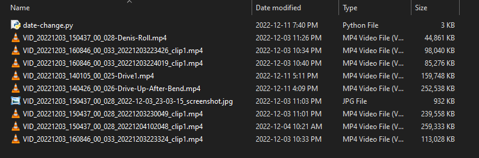
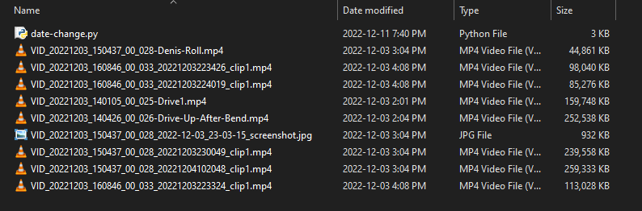
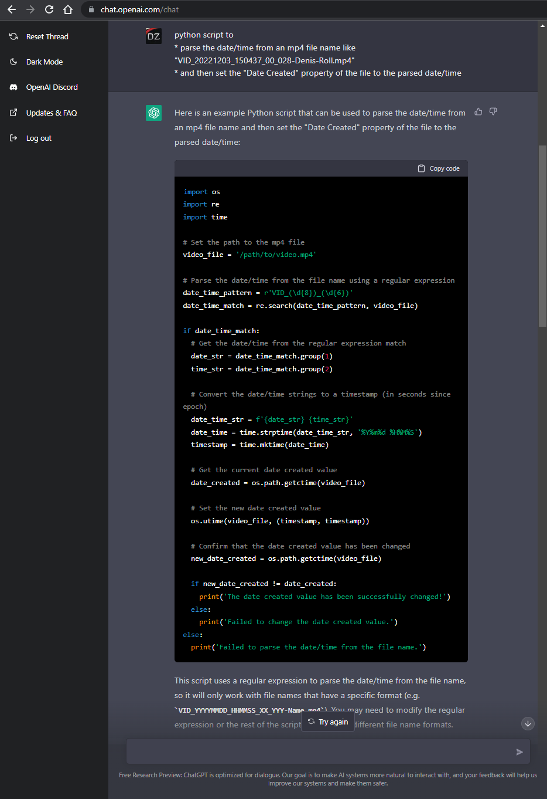

# Insta-360 "Date Modified" change
Changes the exported insta360 video date modified metadata property

When exporting insta360 video files or screen-grabs from a video files,
the files do not contain a date taken attribute.
Also the access/modified date is set to the exported date.

The default file name contains the full date/time info.

This script goes through all the jpg and mp4 files in a specified directory,
matching names similar to "VID_20221203_150437_00_028_20221204102048_clip1.mp4"
and updates the access and modified date from the extracted date/time from the file name.

# Usage
* Edit `date-change.py` to change the `directory`
* Run the script `python3 path/to/insta-360-date-modified-change/date-change.py`
    ```sh
    python3 date-change.py
    ```

# Support Me
If you find the cheat sheet or the source code useful, consider:

* Donating Ko-fi: https://ko-fi.com/deniszholob
* Supporting on Patreon: https://www.patreon.com/deniszholob


# Screenshots

**File Date Modified Before**



**File Date Modified After** 



Fun Fact: The core of this script is based on a prompt for [ChatGPT AI](https://chat.openai.com/chat) with a couple followup proms to tweak the code and solve some errors, and add some personal touches.


